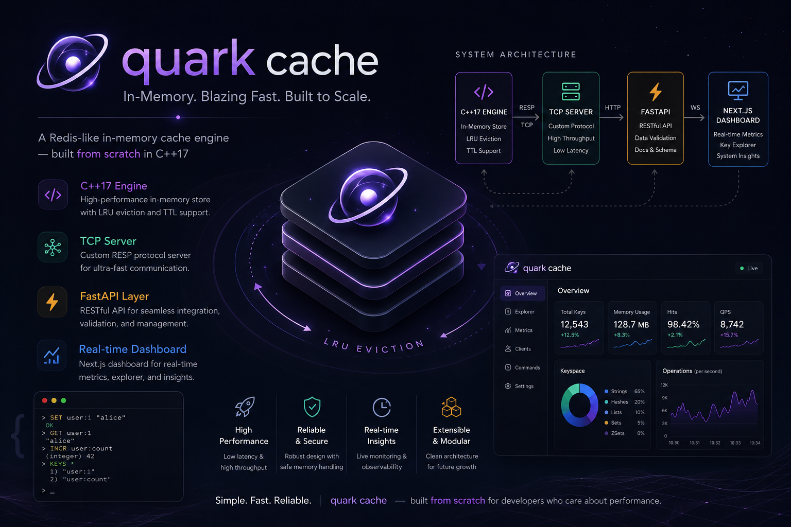

<div align="center">



# ⚡ QuarkCache

### A Redis-like in-memory key-value store built from scratch in C++17

[](https://en.cppreference.com/w/cpp/17)
[](https://fastapi.tiangolo.com)
[](https://nextjs.org)
[](LICENSE)

*Production-grade architecture · O(1) LRU eviction · epoll/kqueue event loop · Real-time dashboard · AI insights*

</div>

---

## What is QuarkCache?

QuarkCache is a **full-stack, production-grade in-memory key-value store** — think Redis, built from the ground up. It demonstrates deep systems programming knowledge across three layers:

- **C++17 engine** — custom LRU cache, per-key TTL, non-blocking TCP server using `epoll` (Linux) / `kqueue` (macOS)
- **FastAPI backend** — async Python bridge exposing REST + benchmark APIs
- **Next.js 16 + MUI dashboard** — real-time metrics, key explorer, REPL, AI insights

```
 Browser (port 3000)
      │
      │  HTTP / REST
      ▼
 FastAPI (port 8000)
      │
      │  TCP text protocol  (SET / GET / DEL / STATS / KEYS)
      ▼
 ┌──────────────────────────────────────────┐
 │        C++ QuarkCache Server (9000)       │
 │                                          │
 │  ┌─────────────┐    ┌─────────────────┐  │
 │  │  LRU Cache  │    │  epoll / kqueue │  │
 │  │  + TTL      │◄───│  event loop     │  │
 │  │  O(1) ops   │    │  non-blocking   │  │
 │  └─────────────┘    └─────────────────┘  │
 └──────────────────────────────────────────┘
```

---

## C++ Engine — Deep Dive

> This section explains the systems-level design decisions behind the C++17 core.

### 1. LRU Eviction — O(1) with Doubly-Linked List + Hash Map

The LRU (Least Recently Used) eviction policy is implemented using the **classic O(1) data structure**:

```
Most Recent                                 Least Recent
    │                                             │
    ▼                                             ▼
┌───────┐   ┌───────┐   ┌───────┐   ┌───────┐   ┌───────┐
│  key5 │ ↔ │  key2 │ ↔ │  key7 │ ↔ │  key1 │ ↔ │  key3 │
└───────┘   └───────┘   └───────┘   └───────┘   └───────┘
   MRU                                              LRU (evict here)

Hash Map: { key5 → list::iterator, key2 → list::iterator, ... }
```

- **`std::list<string>`** — maintains recency order. `splice()` moves any node to front in **O(1)** without reallocation.
- **`std::unordered_map<string, MapValue>`** — gives **O(1)** average lookup. `MapValue` holds the `list::iterator` directly, so promotion is a pointer operation.
- **GET** → lookup in map → move to front via `list::splice()` → return value. All O(1).
- **SET** → if key exists, update + splice to front. If new, push_front + insert into map. If at capacity, erase `list::back()` + map entry. All O(1).

```cpp
// Promote a key to MRU — O(1), no allocation
void LruCache::touch(std::unordered_map<std::string, MapValue>::iterator it) {
    order_.splice(order_.begin(), order_, it->second.order_it);
    it->second.order_it = order_.begin();
}
```

Why not `std::map`? It gives O(log n) lookup. We use `unordered_map` for O(1) average. Why not a vector? Inserting/removing from the middle is O(n). The linked list + hash map combo is the **only** data structure that achieves O(1) for all three operations simultaneously.

---

### 2. TTL — Lazy Expiry + Background Sweep

TTL expiry is handled with two complementary strategies:

**Lazy expiry on access:**
```cpp
std::optional<std::string> LruCache::get(const std::string& key) {
    auto it = map_.find(key);
    if (it == map_.end()) return std::nullopt;

    // Check expiry before returning — lazy deletion
    if (it->second.entry.is_expired()) {
        order_.erase(it->second.order_it);
        map_.erase(it);
        return std::nullopt;   // treat as cache miss
    }
    touch(it);
    return it->second.entry.value;
}
```

**Background sweep every 5 seconds:**
```cpp
// main.cpp — background thread scans the full map
std::thread expiry_thread([&store]() {
    while (true) {
        std::this_thread::sleep_for(std::chrono::seconds(5));
        store->evict_expired();   // O(n) scan, lock-protected
    }
});
expiry_thread.detach();
```

This mirrors Redis's own hybrid approach: lazy deletion on access (fast path, O(1)) + periodic active scan (prevents memory leak from cold keys that are never accessed again).

TTL is stored as a `std::chrono::steady_clock::time_point` — **not** a wall-clock timestamp. `steady_clock` is monotonic and unaffected by system time changes (NTP, DST), which is critical for correctness in a production cache.

```cpp
struct CacheEntry {
    std::string value;
    std::optional<std::chrono::steady_clock::time_point> expires_at;

    bool is_expired() const {
        if (!expires_at) return false;
        return std::chrono::steady_clock::now() >= *expires_at;
    }
};
```

---

### 3. Non-Blocking TCP Server — epoll (Linux) / kqueue (macOS)

The server uses the **reactor pattern** — a single thread monitors many file descriptors via the OS event notification API, dispatching work only when data is ready. No thread-per-connection overhead.

```
epoll_wait() / kevent()
        │
        ├── EPOLLIN on listen_fd  ──► accept() new client
        │
        └── EPOLLIN on client_fd ──► read() → parse → process → write()
```

**Edge-triggered mode (`EPOLLET` on Linux):**  
Unlike level-triggered (which fires repeatedly while data is available), edge-triggered fires **once** when new data arrives. This requires reading in a loop until `EAGAIN` — more complex, but eliminates redundant wake-ups under high load.

```cpp
void TcpServer::handle_read(int event_fd, int client_fd) {
    char buf[4096];
    while (true) {
        ssize_t n = read(client_fd, buf, sizeof(buf));
        if (n > 0) { accumulated.append(buf, n); }
        else if (n == 0) { /* clean disconnect */ break; }
        else {
            if (errno == EAGAIN || errno == EWOULDBLOCK) break; // drained
            /* error */ break;
        }
    }
    // parse CRLF-delimited commands from accumulated buffer
}
```

**Cross-platform via compile-time dispatch:**
```cpp
#if defined(__linux__)
#  include <sys/epoll.h>
#  define USE_EPOLL 1
#elif defined(__APPLE__) || defined(__FreeBSD__)
#  include <sys/event.h>
#  define USE_KQUEUE 1
#endif
```
The same event-loop logic runs on both platforms — `epoll_wait` on Linux, `kevent` on macOS — without runtime overhead.

**Per-client read buffers:**  
TCP is a stream protocol — a single `read()` call may return a partial command or multiple commands concatenated. Each client gets a dedicated `std::string` buffer; complete `\n`-terminated lines are extracted and dispatched:

```cpp
std::unordered_map<int, std::string> read_buffers_; // fd → partial data
```

---

### 4. Thread Safety — Mutex + Atomics

The `KVStore` wraps `LruCache` with a `std::mutex` for all cache operations and `std::atomic` counters for hot metrics:

```cpp
class KVStore {
    std::unique_ptr<LruCache> lru_;
    mutable std::mutex mu_;               // guards all LRU operations

    std::atomic<uint64_t> total_requests_; // lock-free reads from stats thread
    std::atomic<uint64_t> hits_;
    std::atomic<uint64_t> misses_;
    std::atomic<uint32_t> active_connections_;
};
```

**Why `std::atomic` for counters instead of the mutex?**  
Counters are updated on every single request. Locking a mutex for a counter increment would cause contention between the event-loop thread and the background stats thread. `std::atomic` uses CPU hardware instructions (`LOCK XADD` on x86) — no OS involvement, no context switch.

**Why `std::unique_ptr` for `LruCache`?**  
RAII — the destructor automatically frees the cache when `KVStore` goes out of scope. No `delete`, no leaks. This is idiomatic modern C++.

---

### 5. Memory Management — RAII Throughout

Zero raw `new`/`delete` anywhere in the codebase:

| Pattern | Used for |
|---|---|
| `std::unique_ptr<LruCache>` | Sole ownership of the cache in `KVStore` |
| `std::shared_ptr<KVStore>` | Shared ownership between server + expiry thread |
| `std::list` / `std::unordered_map` | Automatic element lifetime management |
| `std::optional<T>` | Nullable returns without raw pointers |
| `std::string` | Heap strings with automatic lifetime |

The server destructor handles cleanup explicitly:
```cpp
TcpServer::~TcpServer() {
    stop();
    if (listen_fd_ != -1) { close(listen_fd_); listen_fd_ = -1; }
    if (epoll_fd_  != -1) { close(epoll_fd_);  epoll_fd_  = -1; }
}
```

---

## Wire Protocol

QuarkCache speaks a **RESP-inspired line-delimited text protocol** over TCP:

```
Client → Server                Server → Client
─────────────────────────────────────────────────────
SET mykey hello 60\r\n    →   OK\r\n
GET mykey\r\n             →   VALUE hello\r\n
DEL mykey\r\n             →   OK\r\n  (or NOT_FOUND\r\n)
STATS\r\n                 →   STATS {"hits":42,"misses":8,...}\r\n
KEYS\r\n                  →   key1 val1 -1\r\nkey2 val2 30\r\nEND\r\n
```

Test it directly with netcat — no client library needed:
```bash
nc 127.0.0.1 9000
SET session:user123 {"name":"Brijesh"} 3600
GET session:user123
STATS
```

---

## Project Structure

```
quark-cache/
├── cpp_core/                    # C++17 cache engine
│   ├── CMakeLists.txt
│   ├── include/quarkcache/
│   │   ├── kv_store.hpp         # Thread-safe public API
│   │   ├── lru_cache.hpp        # LRU eviction + TTL
│   │   └── server.hpp           # epoll/kqueue TCP server
│   └── src/
│       ├── lru_cache.cpp        # O(1) linked-list + hash-map impl
│       ├── kv_store.cpp         # Mutex + atomic metrics wrapper
│       ├── server.cpp           # Non-blocking event loop
│       └── main.cpp             # Entry point + background threads
│
├── backend/                     # Python 3.12 FastAPI layer
│   ├── requirements.txt
│   └── app/
│       ├── main.py
│       ├── routers/             # /health  /keys  /metrics  /benchmarks  /ai
│       ├── services/            # cache_client · metrics · benchmark · ai
│       └── models/schemas.py    # Pydantic request/response models
│
├── frontend/                    # Next.js 16 + MUI v9
│   ├── app/
│   │   ├── dashboard/           # Live sparkline metrics
│   │   ├── keys/                # Key explorer (CRUD)
│   │   ├── metrics/             # Time-series charts
│   │   ├── clients/             # Active connections monitor
│   │   ├── commands/            # Interactive Redis-style REPL
│   │   ├── benchmarks/          # Throughput / latency runner
│   │   ├── ai/                  # AI insights + GPT-4o chat
│   │   └── settings/            # Server configuration
│   ├── components/              # Recharts sparklines, donut, OPS chart
│   ├── lib/apiClient.ts
│   └── types/index.ts
│
└── docker/
    ├── Dockerfile.cpp
    ├── Dockerfile.backend
    ├── Dockerfile.frontend
    └── docker-compose.yml
```

---

## Quick Start

### 1 — Build the C++ server

```bash
cd cpp_core
cmake -B build -DCMAKE_BUILD_TYPE=Release
cmake --build build --parallel
./build/quarkcache_server
# [QuarkCache] Listening on 127.0.0.1:9000
```

> Requires: `cmake ≥ 3.16`, `g++ ≥ 11` (C++17). Works on Linux (epoll) and macOS (kqueue).

### 2 — Start the FastAPI backend

```bash
cd backend
python -m venv .venv && source .venv/bin/activate
pip install -r requirements.txt
uvicorn app.main:app --reload --port 8000
# Interactive docs → http://localhost:8000/docs
```

### 3 — Start the Next.js dashboard

```bash
cd frontend
npm install
npm run dev
# Dashboard → http://localhost:3000
```

**Three-terminal dev loop:**
```
Terminal 1 │ ./cpp_core/build/quarkcache_server          (port 9000)
Terminal 2 │ uvicorn app.main:app --reload --port 8000   (port 8000)
Terminal 3 │ npm run dev                                  (port 3000)
```

### Optional — AI-enhanced insights

Set your OpenAI key to unlock GPT-4o-powered cache analysis in the AI Insights page:
```bash
export OPENAI_API_KEY=sk-...
uvicorn app.main:app --reload --port 8000
```
Without the key, the AI page uses a built-in rule-based analysis engine — no API calls needed.

---

## Docker

```bash
cd docker && docker compose up --build
```

All three services start together. The C++ server uses `epoll` — on macOS/Windows, Docker handles the Linux environment automatically.

---

## Performance

| Operation | Complexity | Notes |
|---|---|---|
| GET | O(1) avg | Hash map lookup + list splice |
| SET | O(1) avg | Hash map insert + list push_front |
| DEL | O(1) avg | Hash map erase + list erase |
| LRU evict | O(1) | Always evicts `list::back()` |
| TTL sweep | O(n) | Background thread, every 5s |
| STATS | O(1) | Atomic reads, no lock |

Typical throughput on a MacBook Air M2: **~50,000–80,000 ops/sec** over local TCP with the Python asyncio client.

---

## Roadmap

| Feature | Complexity | Description |
|---|---|---|
| AOF Persistence | Medium | Append every write to a log file; replay on restart |
| Pub/Sub | Medium | Subscribe fds to channels; fan-out on PUBLISH |
| Pipelining | Low | Batch multiple commands in one TCP round-trip |
| Consistent Hashing | High | Distribute keyspace across multiple server instances |
| Replication | High | Primary → replica streaming of write commands |
| TLS | Medium | Wrap accept socket with OpenSSL for encrypted transport |

---

## Tech Stack

| Layer | Technology | Why |
|---|---|---|
| Cache engine | C++17 | Zero-overhead abstractions, RAII, direct OS syscalls |
| Event loop | epoll / kqueue | O(1) I/O readiness, scales to 10k+ connections |
| Concurrency | `std::mutex` + `std::atomic` | Fine-grained locking, lock-free hot paths |
| REST API | FastAPI + asyncio | Non-blocking Python, auto OpenAPI docs |
| Dashboard | Next.js 16 + MUI v9 | App Router, TypeScript strict mode, Recharts |
| AI layer | OpenAI GPT-4o-mini | Cache performance analysis and recommendations |
| Containers | Docker + Compose | One-command reproducible environment |

---

<div align="center">

Built with deep systems knowledge by **Brijesh Kumar**

*If you're hiring for systems, backend, or full-stack roles — [let's talk](https://github.com/Brijesh03032001)*

</div>
